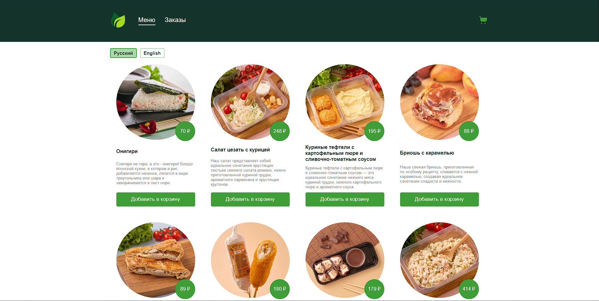

# Мультиязычное приложение доставки еды

### Использованные технологии:

- React
- Typescript
- Firebase Realtime Database
- Redux toolkit
- RTK Query
- SCSS
- i18next
- react router dom
- react hook form

### Для запуска проекта:

- Склонировать проект
- npm install
- npm run start

### Дополнительная информация:

- Приложение доступно на двух языках (русский и английский)  
- Реализована JWT авторизация  
- На главной странице реализован infinity scroll
- Верстка адаптивная

[Ссылка на приложение](https://platov-delivery-food.surge.sh/)

